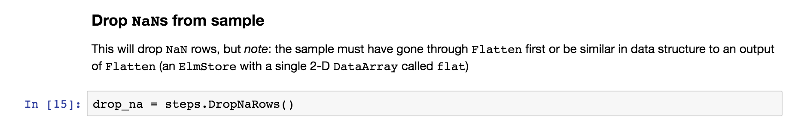
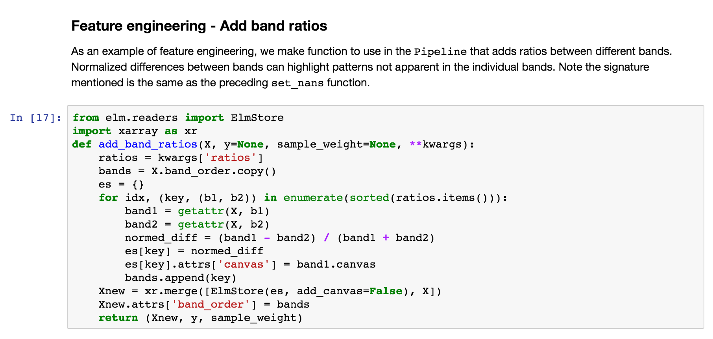
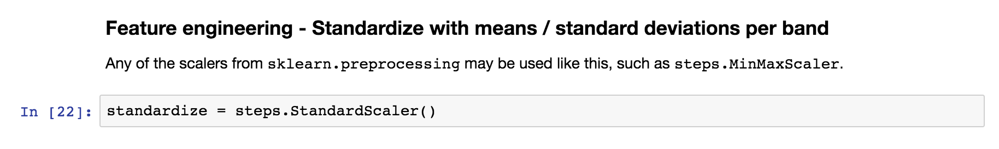
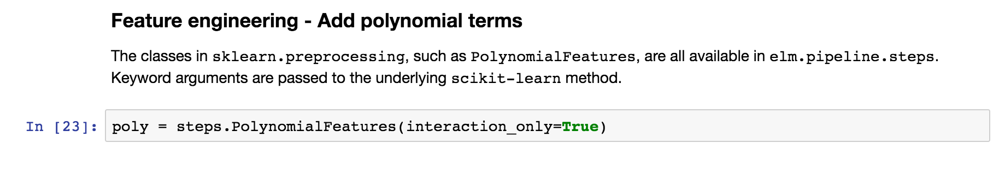
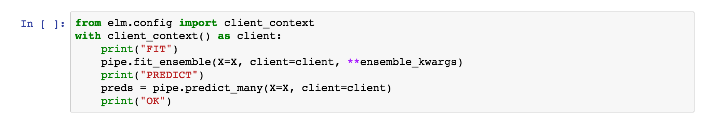
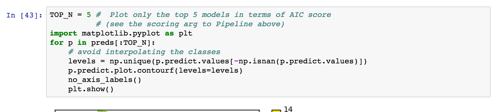
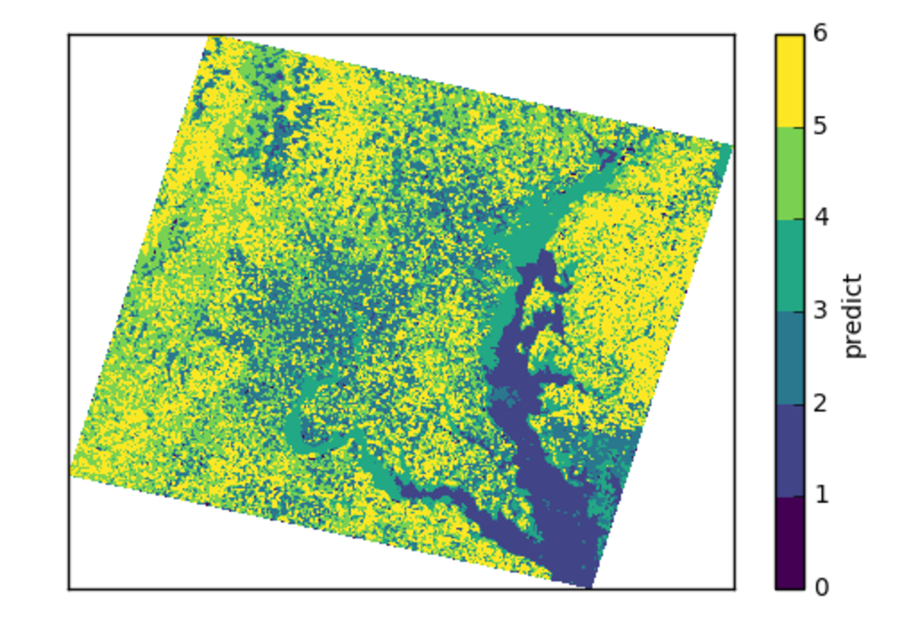

Tutorials
=========

This page walks through a ``Jupyter`` notebook using ``elm`` to ensemble fit K-Means and predict from all members of the ensemble.

It demonstrates the common steps of using ``elm`` :

 * Working with ``earthio.load_array`` to read ``NetCDF`` , ``HDF4`` , ``HDF5`` , and GeoTiff files, and controlling how a sample is composed of bands or separate rasters with ``BandSpec`` . See also :ref:`elm-store-from-file`
 * Defining a ``Pipeline`` of transformers (e.g. normalization and PCA) and an estimator, where the transformers use classes from ``elm.pipeline.steps`` and the estimator is a model with a ``fit`` / ``predict`` interface.  See also :doc:`Pipeline<pipeline>`
 * Calling :doc:`fit_ensemble<fit-ensemble>` to train the :doc:`Pipeline<pipeline>` under varying parameters with one or more input samples
 * Calling :doc:`predict_many<predict-many>` to predict from all trained ensemble members to one or more input samples

.. _elm examples: https://github.com/ContinuumIO/elm/tree/master/examples

.. _AWS S3 LANDSAT bucket here: http://landsat-pds.s3.amazonaws.com/L8/015/033/LC80150332013207LGN00/index.html

LANDSAT
~~~~~~~

The LANDSAT classification is notebook from `elm examples`_.  This section walks through that notebook, pointing out:

 * How to use ``earthio`` for scientific data files like GeoTiffs
 * How to set up an ``elm.pipeline.Pipeline`` of transformations
 * How to use ``dask`` to ``fit`` a ``Pipeline`` in ensemble and predict from many models

**NOTE** : To follow along, make sure you follow the :ref:`Prerequisites`.  The LANDSAT sample used here can be found in the `AWS S3 LANDSAT bucket here`_.

``earthio`` Walk-Through
~~~~~~~~~~~~~~~~~~~~~~~~~~~~

First the notebook sets some environment variables related to usage of a ``dask-distributed`` ``Client`` and the path to the GeoTiff example files from `elm-data`_:

Each GeoTiff file has 1 raster (band of LANDSAT data):

.. image:: img/landsat_001.png

See more inforation on ``ElmStore`` in :doc:`ElmStore<elm-store>`.

``earthio.BandSpec``
~~~~~~~~~~~~~~~~~~~~~~~~~

Using a list of ``BandSpec`` objects, as shown below, is how one can control which bands, or individual GeoTiff files, become the sample dimensions for learning:

 * ``buf_xsize``: The size of the output raster horizontal dimension
 * ``buf_ysize``: The size of the output raster vertical dimension
 * ``name``: What do call the band in the ``ElmStore`` returned. For example ``band_1`` as a name will mean you can use ``X.band_1`` and find ``band_1`` as a key in ``X.data_vars``.
 * ``search_key``: Where to look for the band identifiying info, in this case the file ``name``
 * ``search_value`` : What string token identifies a band, e.g. ``B1.TIF``  (see file names printed above)

We are using ``buf_xsize`` and ``buf_ysize`` below to downsample.

.. image:: img/landsat_003.png

Check the ``repr`` of the ``BandSpec`` objects to see all possible arguments controlling reading of bands:

.. image:: img/landsat_004.png

``earthio.load_array``
~~~~~~~~~~~~~~~~~~~~~~~~~~

``load_array`` aims to find a file reader for a ``NetCDF``, ``HDF4``, ``HDF5``, or GeoTiff source.

The first argument to ``load_array`` is a directory if reading GeoTiff files and it is assumed that the directory contains GeoTiff files each with a 1-band raster.

For ``NetCDF``, ``HDF4``, and ``HDF5`` the first argument is a single filename, and the bands are taken from the ``variables`` (``NetCDF``) or ``subdatasets`` (``HDF4`` / ``HDF5``).

``band_specs`` (list of ``BandSpec`` objects) is passed in to ``load_array`` (the list of ``BandSpec`` objects from above) to control which bands are read from the directory of GeoTiffs.

.. image:: img/landsat_005.png

Using an ``ElmStore`` like an (xarray.Dataset)
~~~~~~~~~~~~~~~~~~~~~~~~~~~~~~~~~~~~~~~~~~~~~
See also `xarray docs on Dataset`_

.. _xarray docs on Dataset: http://xarray.pydata.org/en/stable/data-structures.html#dataset

.. image:: img/landsat_006.png

.. _xarray.DataArray: http://xarray.pydata.org/en/stable/generated/xarray.DataArray.html

Visualization with ``ElmStore``
~~~~~~~~~~~~~~~~~~~~~~~~~~~~~~~

The notebook then goes through a number of examples similar to:

 * ``X.band_1.plot.pcolormesh()`` - The code uses names like ``band_1``, ``band_2``.  These are named ``DataArray`` objects in the ``ElmStore`` ``X`` because of the ``name`` argument to the ``BandSpec`` objects above.  The ``plot.pcolormesh()`` comes from the data viz tools with `xarray.DataArray`_ .
 * The output of ``X.band_1.plot.pcolormesh()``

.. image:: img/landsat_007.png

Building a ``Pipeline``
~~~~~~~~~~~~~~~~~~~~~~~

Building an ``elm.pipeline.Pipeline`` of transformations is similar to the idea of a `Pipeline` in scikit-learn.

* All steps but the last step in a `Pipeline` must be instances of classes from the `elm.pipeline.steps` - these are the transformers.
* The final step in a `Pipeline` should be an estimator from `scikit-learn` with a `fit`/`predict` interface.

The notebook shows how to specify a several-step `Pipeline` of
 * Flattening rasters
 * Assigning `NaN` where needed
 * Dropping `NaN` rows
 * Standardizing (Z-scoring) by band means and standard deviations
 * Adding polynomial interaction terms of degree two
 * Transforming with PCA
 * K-Means with `partial_fit` several times per model

**Preamble - Imports**

This cell show typical import statments for working with a ``elm.pipeline.steps`` that become part of a ``Pipeline``, including importing a transformer and estimator from scikit-learn:

.. image:: img/landsat_009.png

Steps - ``Flatten``
~~~~~~~~~~~~~~~~~~~

This :ref:`transform-flatten` step is essentially ``.ravel`` on each ``DataArray`` in ``X`` to create a single 2-D ``DataArray`` :

.. image:: img/landsat_010.png

Steps - ``ModifySample`` - ``set_nans``
~~~~~~~~~~~~~~~~~~~~~~~~~~~~~~~~~~~~~~~

The next step uses ``elm.pipeline.steps.ModifySample`` to run a custom callable in a ``Pipeline`` of transformations.  This function sets ``NaN`` for the no-data perimeters of the rasters:

.. image:: img/landsat_011.png

Steps - ``DropNaRows`` - Drop Null / NaN Rows
~~~~~~~~~~~~~~~~~~~~~~~~~~~~~~~~~~~~~~~~~

The :ref:`transform-dropnarows` is a transformer to remove the ``NaN`` values from the ``DataArray`` ``flat`` (the flattened (``ravel``) rasters as a single 2-D ``DataArray`` )

Steps - ``ModifySample`` - Log Transform (or pass through)
~~~~~~~~~~~~~~~~~~~~~~~~~~~~~~~~~~~~~~~~~~~~~~~~~~~~~~~~~~

This usage of ``ModifySample`` will allow the ``Pipeline`` to use log transformation or not (see usage of ``set_params`` several screenshots later)

.. image:: img/landsat_013.png

Feature engineering in a ``Pipeline``
~~~~~~~~~~~~~~~~~~~~~~~~~~~~~~~~~~~~~

Define a function that can do normalized differences between bands (raster or ``DataArray`` ), adding the normalized differences to what will be the ``X`` data in the ``Pipeline`` of transformations.

Feature engineering - ``ModifySample`` with arguments
~~~~~~~~~~~~~~~~~~~~~~~~~~~~~~~~~~~~~~~~~~~~~~~~~

And here is how the function above can be used in a ``Pipeline`` (wrapping with ``elm.pipeline.steps.ModifySample`` ):

We are calculating:

* ``NDWI`` : *Normalized Difference Water Index*
  * ``(band_4 - band_5) / (band_4 + band_5)``
* ``NDVI`` : *Normalized Difference Vegetation Index*
  * ``(band_5 - band_4) / (band_5 + band_4)``
* ``NDSI`` : *Normalized Difference SnowIndex*
  * ``(band_2 - band_6) / (band_2 + band_6)``
* ``NBR`` : *Normalized Burn Ratio*
  * ``(band_4 - band_7) / (band_7 + band_4)``

.. image:: img/landsat_015.png

**Using pcolormesh on normalized differences of bands**

Here are the ``NDWI`` and ``NDVI`` plotted with the `xarray-pcolormesh`_ method of the ``predict`` ``DataArray``

.. image:: img/landsat_016.png

**False Color with normalized differences of bands**

The image below has an RGB (red, green, blue) matrix made up of the ``NBR`` , ``NDSI`` , ``NDWI`` normalized differences:

.. image:: img/landsat_017.png

Normalization and Adding Polynomial Terms
~~~~~~~~~~~~~~~~~~~~~~~~~~~~~~~~~~~~~~~~~

The following snippets show how to use a class from ``sklearn.preprocessing`` or ``sklearn.feature_selection`` with ``Pipeline`` :

**Custom Feature Selection**

By defining the function below, we will be able to choose among random combinations of the original data or normalized differences

.. image:: img/landsat_020.png

PCA
~~~

Use ``steps.Transform`` to wrap ``PCA`` or another method from ``sklearn.decomposition`` for ``elm.pipeline.Pipeline`` .

.. image:: img/landsat_021.png

.. _more on sklearn.decomposition models here: http://scikit-learn.org/stable/modules/classes.html#module-sklearn.decomposition

Read `more on sklearn.decomposition models here`_.

Use an estimator from ``scikit-learn``
~~~~~~~~~~~~~~~~~~~~~~~~~~~~~~~~~~~~~~

Use a model with a ``fit`` / ``predict`` interface, such as ``KMeans``.

.. image:: img/landsat_022.png

Most `scikit-learn models described here`_ are supported.

.. _scikit-learn models described here: http://scikit-learn.org/stable/modules/classes.html#module-sklearn.base

Create ``Pipeline`` instance
~~~~~~~~~~~~~~~~~~~~~~~~~~~~

The following uses all the steps we have created in sequence of tuples and configures scoring for K-Means with the `Akaike Information Criterion`_.

.. _Akaike Information Criterion: https://en.wikipedia.org/wiki/Akaike_information_criterion

.. image:: img/landsat_023.png

The next steps deal with controlling :doc:`fit_ensemble<fit-ensemble>` (fitting with a group of models of different parameters)

See more info on :doc:`Pipeline here<pipeline>`.

``ensemble_init_func``
~~~~~~~~~~~~~~~~~~~~~~

This is an example ``ensemble_init_func`` to pass to :doc:`fit_ensemble<fit-ensemble>`, using ``pipe.new_with_params(**new_params)`` to create a new unfitted ``Pipeline`` instance with new parameters.

.. image:: img/landsat_024.png

The :doc:`fit_ensemble docs<fit-ensemble>` also show an example of an ``ensemble_init_func``.

More ``fit_ensemble`` control
~~~~~~~~~~~~~~~~~~~~~~~~~~~~~

The following sets the number of generations ( ``ngen`` ) and the ``model_selection`` callable after each generation.

.. image:: img/landsat_025.png

Parallelism with ``dask-distributed``
~~~~~~~~~~~~~~~~~~~~~~~~~~~~~~~~~~~~~

:doc:`fit_ensemble<fit-ensemble>` , to fit a group of models in generations with model selection after each generation, and :doc:`predict_many<predict-many>` each take a ``client`` keyword as a dask ``Client`` (dask).  :doc:`predict_many<predict-many>` parallelizes over multiple models and samples, though here only one sample is used.

.. image:: img/landsat_027.png

Using an ``ElmStore`` from :doc:`predict_many<predict-many>`
~~~~~~~~~~~~~~~~~~~~~~~~~~~~~~~~~~~~~~~~~~~

:doc:`predict_many<predict-many>` has called :ref:`transform-inverseflatten` to reshape the 1-D numpy array from the ``sklearn.cluster.KMeans.predict`` method to a 2-D raster with the coordinates of the original data.  Note also the ``inverse_flatten`` is typically able to preserve ``NaN`` regions of the original data (the ``NaN`` borders of this image are preserved).

Using the `xarray's pcolormesh`_ on the ``predict`` attribute ( ``DataArray`` ) of an ``ElmStore`` returned by :doc:`predict_many<predict-many>` :

The best prediction in terms of ``AIC`` :

.. _xarray's pcolormesh: http://xarray.pydata.org/en/stable/generated/xarray.plot.pcolormesh.html
